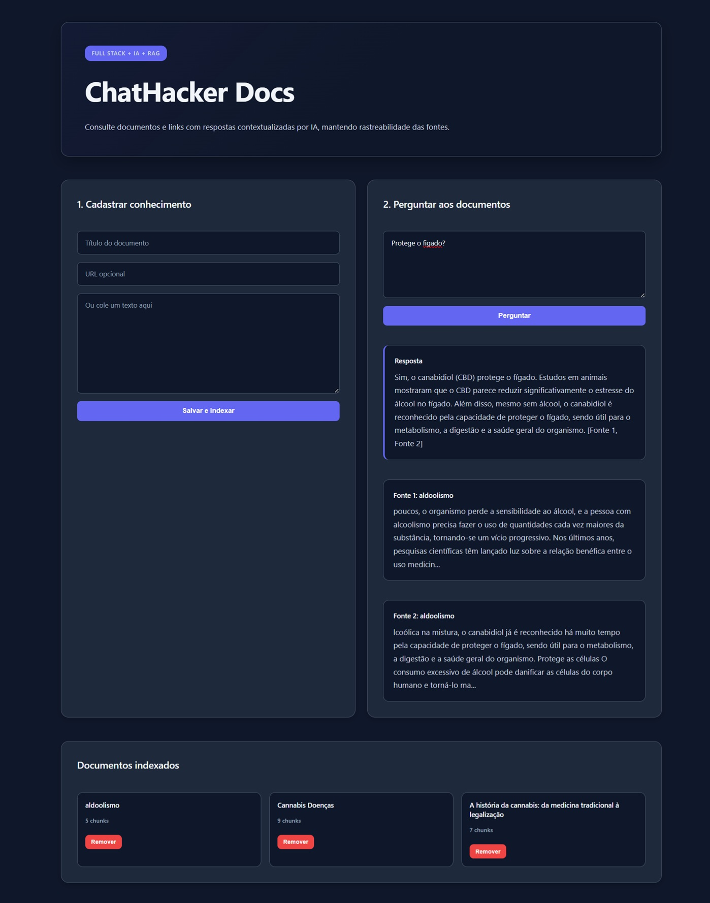

# ChatHacker Docs

Plataforma Full Stack para consulta inteligente de documentos e links usando uma arquitetura de RAG simples: ingestão de conteúdo, divisão em chunks, recuperação de contexto e resposta com IA.



## Por que esse projeto existe

Este projeto foi criado para demonstrar domínio de desenvolvimento Full Stack moderno e aplicação prática de IA generativa em um problema real: permitir que usuários consultem documentos, páginas e bases de conhecimento sem depender apenas da memória do modelo.

## Stack

- Next.js 15 — front-end, rotas de API e SSR no mesmo projeto.
- TypeScript — segurança de tipos e manutenção.
- Prisma ORM — camada de acesso a dados limpa e produtiva.
- SQLite — banco local simples para portfólio e demonstração.
- Zod — validação de payloads nas APIs.
- Cheerio — extração de texto de páginas web.
- OpenAI-compatible API — permite usar OpenAI, Gemini via endpoint compatível ou outro provedor.

## Funcionalidades

✅ **Cadastro de Documentos**
- Adicionar por texto direto ou URL
- Conteúdo é quebrado em chunks para recuperação eficiente
- Remoção de documentos quando necessário

✅ **Busca Inteligente**
- Recuperação lexical de trechos relevantes
- Ranking automático por relevância

✅ **Resposta com IA**
- Integração com Google Gemini (compatível com outros provedores)
- Resposta sempre cita as fontes utilizadas
- Fallback gracioso se IA estiver indisponível

✅ **Interface Profissional**
- Design responsivo e moderno
- Dashboard claro para gerenciar documentos
- Exibição clara de respostas e fontes

## Arquitetura


1. O usuário cadastra um texto ou uma URL.
2. O backend limpa o conteúdo.
3. O texto é quebrado em chunks menores.
4. Os chunks são salvos no banco.
5. Quando o usuário faz uma pergunta, o sistema busca os chunks mais relevantes.
6. A IA responde usando somente o contexto encontrado.
7. A interface mostra a resposta e as fontes utilizadas.

## Decisões técnicas

### Next.js full stack

Escolhi Next.js porque permite construir uma aplicação completa com front-end e backend no mesmo repositório. Isso reduz complexidade para MVP, facilita deploy e demonstra capacidade de trabalhar com produto de ponta a ponta.

### Prisma + SQLite

Usei Prisma para ter uma camada de dados organizada e migrável. SQLite foi escolhido para facilitar a execução local, sem obrigar o avaliador a subir PostgreSQL ou Docker. Em produção, a troca para PostgreSQL é simples alterando o provider e a DATABASE_URL.

### RAG lexical inicial

Em vez de começar com vector database, implementei uma busca lexical simples por score de tokens. A decisão reduz dependências externas e deixa o projeto fácil de rodar. A evolução natural é substituir essa camada por embeddings e pgvector, Pinecone, Weaviate ou Qdrant.

### Provedor de IA compatível com OpenAI

A integração usa o formato `/chat/completions`, permitindo plugar OpenAI ou Gemini com endpoint compatível. Isso mostra preocupação com flexibilidade de fornecedor.

## Como rodar

### 1. Setup inicial

```bash
# Clonar/abrir o repositório
cd chathacker-docs

# Copiar arquivo de configuração
cp .env.example .env  # ou copiar manualmente no Windows

# Instalar dependências
npm install

# Gerar cliente Prisma
npx prisma generate

# Sincronizar banco de dados
npx prisma db push

# Iniciar servidor de desenvolvimento
npm run dev
```

### 2. Acessar a aplicação

Abra o navegador em:

```
http://localhost:3000
```

A aplicação estará rodando e pronta para cadastrar documentos e fazer perguntas.

### Alternativa para Windows (se tiver problemas com PowerShell)

Se encontrar erro de execução de scripts no PowerShell, use Node.js diretamente:

```bash
# Sincronizar banco
node -e "require('child_process').spawnSync('npx', ['prisma', 'db', 'push', '--skip-generate'], { stdio: 'inherit' })"

# Iniciar servidor
node start-server.js
```

## Variáveis de ambiente

Copie `.env.example` para `.env` e configure:

```env
DATABASE_URL="file:./dev.db"                    # Local do banco SQLite
AI_API_KEY="sua-chave-aqui"                     # Chave da API Google Gemini
AI_MODEL="gemini-3.5-flash"                     # Modelo da IA (ou outro disponível)
NEXT_PUBLIC_APP_NAME="ChatHacker Docs"          # Nome da aplicação
```

**Sem `AI_API_KEY`:** O projeto ainda cadastra documentos, recupera fontes e busca contexto, mas a resposta automática mostrará um aviso.

**Modelos Gemini testados:**
- `gemini-3.5-flash`
- `gemini-2.5-flash` (recomendado)
- `gemini-1.5-flash`
- `gemini-pro`


## Próximas melhorias

- Upload de PDF real pela interface.
- Autenticação com NextAuth.
- PostgreSQL + pgvector.
- Embeddings para busca semântica.
- Histórico de conversas.
- Multi-tenant por usuário ou empresa.
- Testes com Jest/Supertest.
- Deploy na Vercel ou AWS.
